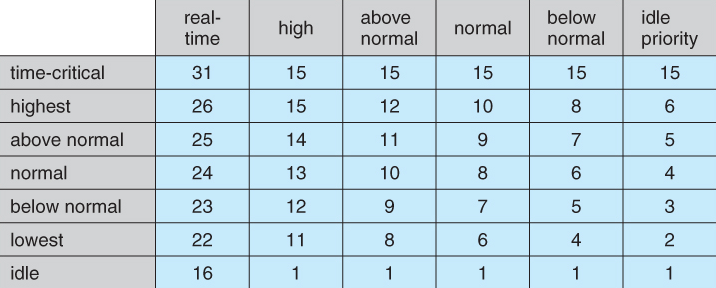

# Apresentação da Disciplina
- Programas em C para criar processos e threads
	- AV1: 2 provas (semanas 5 e 7)
- Problemas associados a concorrencia de processos
	- AV2: 4 atividades em C
- Gerenciamento de memória
	- AV3: prova (semana 17) + prova (trabalho do pendrive: deletar 1 dos 4 arquivos e recuperar)

# Sistema Operacional
- Escalonamento de processos
- Gerenciamento de memória
- Sistema de arquivos (enxergar o disco de forma logica ao inves de fisica)
- Interface Gráfica
- Interface de Programação - API
	- System Calls

Drivers: extensão do SO

# System Calls
- [Documentação API do Windows win32](https://docs.microsoft.com/en-us/windows/win32/apiindex/windows-api-list)
	- [Funções de Dialog Box](https://docs.microsoft.com/en-us/windows/win32/dlgbox/dialog-box-functions)
		- [MessageBox](https://docs.microsoft.com/en-us/windows/win32/api/Winuser/nf-winuser-messagebox)

```C
#include <stdio.h>
#include <stdlib.h>
#include <windows.h>

int main() {
    int x = MessageBox(NULL, "Sim?", "Título Top", MB_OKCANCEL)
    
    if (x == IDOK) {
        printf("Você clicou OK")
    } else if (x == IDCANCEL) {
        printf("Você cancelou, F")
    }

    return 0;
}
```

OBS: System Calls no KDE em bash: [KDE Shell Scripting](https://develop.kde.org/deploy/kdialog/)

#Todo 
- Criar arquivo de texto em branco
	- Storage / CreateFile

# Processos
- 1 ou mais por programa
- Criados por System Call

```C
#include <stdio.h>
#include <stdlib.h>
#include <windows.h>

int main()
{
	BOOL bInheritHandles = FALSE;
	DWORD dwCreationFlags = 0;
	STARTUPINFOA startupInfo;
	PROCESS_INFORMATION processInformation;

	ZeroMemory(&startupInfo, sizeof(startupInfo));

	int x = CreateProcessA(
		"C:\\Windows\\System32\\notepad.exe",
		NULL,
		NULL,
		NULL,
		bInheritHandles,
		dwCreationFlags,
		NULL,
		NULL,
		&startupInfo,
		&processInformation);

	return 0;
}
```

# Tabela de Processos
- Registrador de Segmento + Registrador de Índice
	- CS:IP é guardado na tabela de processos sempre que processo sai do processador 
- Foreground / Background
	- Foreground requer inicialização / interação do usuario
- Estado
	- Running, Blocked, Ready
- PID
	- Identificador do processo
- Handle
	- Exemplo: abertura de arquivo retorna handle, leitura recebe handle
- Lista de arquivos associados

# Threads
- Divisões independentes de um processo
- Threads de um mesmo processo compartilham recursos
- Processo acaba quando a thread principal acaba

- Possuem: TID, valor dos registradores da CPU, Stack (localizações de retorno)

- Thread de Núcleo - Kernel Thread: criada pelo SO
- Thread de Usuário - User Thread: criada pelo programador
	- exemplo: include <pthread.h>

- User Threads são mapeadas para Kernel Threads
	- uma Kernel Thread pode ter várias User Threads
		- "escalonamento do escalonamento"

# Conceitos de Escalonamento
- Preempção: Retirada forçada de um processo da CPU
- Starvation: demora ou não atendimento de um processo

- Time Slice (quanta): tempo dado antes de sofrer preempção 

Turn Around = ∑t(execução) + ∑t(espera)
- Turnaround / Tempo de resposta: criação até finalização do processo
- Burst Time / Tempo de execução
	- Soma dos Time Slices completos + Porcentagem do Time Slice Final
- Tempo de espera

# Escalonamentos Básicos
FIFO
- vantagem: simples
- desvantagem: esperar um processo demorado que chegou primeiro

SJF - Shortest Job First
- vantagem: ótimo, minimiza Turnaround
- desvantagem: starvation, dificil determinar o shortest job

Round Robin
- FIFO + Preempção

Múltiplas Filas
- Primeira Fila - Prioridade máxima - 1 time slice
- 2 time slices
- 4 time slices
- ...
- Última Fila - Menor prioridade - 64 time slices 

# Escalonamento no Windows
- Escalonamento de Threads
- 32 Filas
- Round Robin em cada fila
	- time slice de 10 a 100ms
- Tabela com Thread versus Processo define a fila em que a Thread entra
	- Prioridade 0 - Zero Page Threads: processo que zera memória RAM



- Thread pode ir para uma fila de maior prioridade quando é desbloqueada
	- por dispositivo I/O (Disco, Teclado, Placa de Som)
	- por semáforos
		- variável usada para controlar acesso a um recurso usado por múltiplas threads
	- no máximo para fila 15, a não ser que seja real-time
	- "tirar o atraso"

- Thread pode ir para uma fila de prioridade menor caso não esteja na prioridade inicial
	- vai pro final da fila de baixo
	- prioridade não pode ser menor que a prioridade inicial
	- quando acaba o time slice, vai pro final da fila

# Escalonamento no Linux
[Process Scheduling in Linux](https://medium.com/geekculture/process-scheduling-in-linux-592028a5d545)

Real-Time Scheduling
- FIFO and RR

Conventional Scheduling
- CFS - Completely Fair Scheduling
	- every process gets an even time slice of the CPU
- Virtual Runtime
	- amount of time spent by actually executing, not including any form of waiting
- Balanced Binary Search Tree
	- insertion, deletion and look-up are performed in O(logN)
- min_vruntime
	- new processes
	- process that got back to ready state from waiting
- Context switch
	- the process of storing the state of a process or thread, so that it can be restored and resume execution at a later point
- min_granularity
	- major slowdown if the time slice is close to the context switch cost

Algorithm
- sets himself a time limit — sched_latency
- each process will get a time slice of max(min_granularity, sched_latency/N)
	- prioritizes the process with the least virtual runtime

CFS vs RR
- time slice: dynamic vs static
- after tiem slice: lowest vruntime vs next from cyclic list

# Threads em C
OBS: gcc -pthread para utilizar a biblioteca

Criando 2 Threads
- pthread_join é necessário pois sem ele a thread principal acaba e o processo é finalizado

```C
#include <stdio.h>
#include <stdlib.h>
#include <pthread.h>

void *a()
{
    for (int i = 0; i < 1000; i++)
    {
        printf("a\n");
    }

    return NULL;
}

void *b()
{
    for (int i = 0; i < 1000; i++)
    {
        printf("b\n");
    }

    return NULL;
}

void main()
{
    pthread_t A, B;
    pthread_create(&B, NULL, b, NULL);
    pthread_create(&A, NULL, a, NULL);
    pthread_join(A, NULL);
    pthread_join(B, NULL);
}

```

Enviando parâmetros para a Thread
- note que o nome da função já é um ponteiro, que nem em vetores
- ao receber o parâmetro, devemos fazer seu casting para que ele possa ser usado

```C
#include <stdio.h>
#include <stdlib.h>
#include <pthread.h>

void *print_thread(void *x)
{
	int n = *(int *)x;

	for (int i = 0; i < 100; i++)
	{
		printf("%d\n", n);
	}

	return NULL;
}

int main()
{
	pthread_t t1, t2, t3, t0;
	int n1 = 1, n2 = 2, n3 = 3, n0 = 0;

	pthread_create(&t0, NULL, print_thread, &n0);
	pthread_create(&t1, NULL, print_thread, &n1);
	pthread_create(&t2, NULL, print_thread, &n2);
	pthread_create(&t3, NULL, print_thread, &n3);

	pthread_join(t1, NULL);
	pthread_join(t2, NULL);
	pthread_join(t3, NULL);
	pthread_join(t0, NULL);

	return 69;
}

```

Threads compartilham recurso de memória
- context switch mais leve
- Race Condition - Problema de Sincronização
	- Incremento  --Preempção-- Salvar na Memória
	- Resultado dá menor que 400000
		- para 40000, depois de muitas tentativas, deu 39575 

```C
#include <stdio.h>
#include <stdlib.h>
#include <pthread.h>

int balance = 0;

void *increment(void *x)
{
	int n = *(int *)x;

	for (int i = 0; i < 100000; i++)
	{
		balance++;
	}

	return NULL;
}

int main()
{
	pthread_t t1, t2, t3, t0;
	int n0 = 0, n1 = 1, n2 = 2, n3 = 3;

	pthread_create(&t0, NULL, increment, &n0);
	pthread_create(&t1, NULL, increment, &n1);
	pthread_create(&t2, NULL, increment, &n2);
	pthread_create(&t3, NULL, increment, &n3);

	pthread_join(t0, NULL);
	pthread_join(t1, NULL);
	pthread_join(t2, NULL);
	pthread_join(t3, NULL);

	printf("Balance: %d", balance);

	return 69;
}


```

# Sincronização de Threads - Algoritmos de Espera Ocupada
Região crítica não pode ser escalonada
- é tipo um banheiro
- balance++

- Mútua Exclusão
	- garantia de que nenhuma thread vai entrar na região crítica enquanto outra thread estiver na região crítica
- Não deve haver Starvation
- Se a thread não usa a região crítica, não bloquear outra thread
	- ou caga ou libera a moita
- Algoritmo deve ser independente do hardware

##### Algoritmo do Intertravamento
```C
while (busy) {}
busy = 1;

balance++;

busy = 0;
```

- Não funciona! 
	- Mútua Exclusão
- Empurrou o problema para outra variável
	- Variável da variável da variável da variável da ...

##### Algoritmo da Alternância Mútua
```C
while (n != panel) {}

balance++;

panel = (panel + 1) % 4;
```

- o primeiro da fila bloqueia todos os próximos
	- ou caga ou libera a moita
	
##### Algoritmo de Peterson
```C
int key = 1;
while (key)
{
    asm("xchg %0, %1"
        : "+q"(key), "+m"(lock));
}

balance++;

lock = 0;
```

- se lock for 1, troca 1 por 1, nada muda
- troca key e lock na mesma instrução, impossível preempção
- depende do hardware
	- na arquitetura x86 tem
